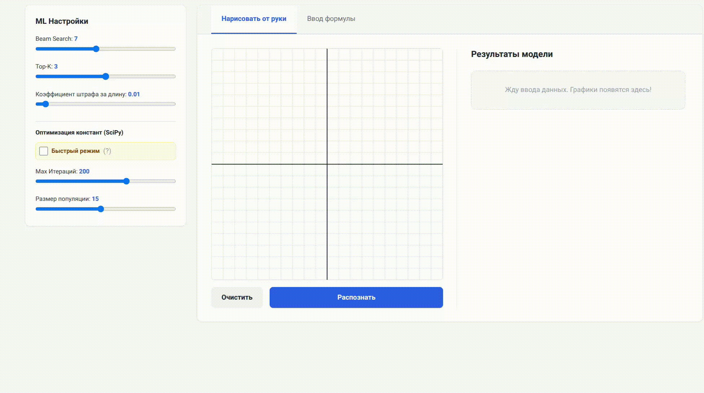
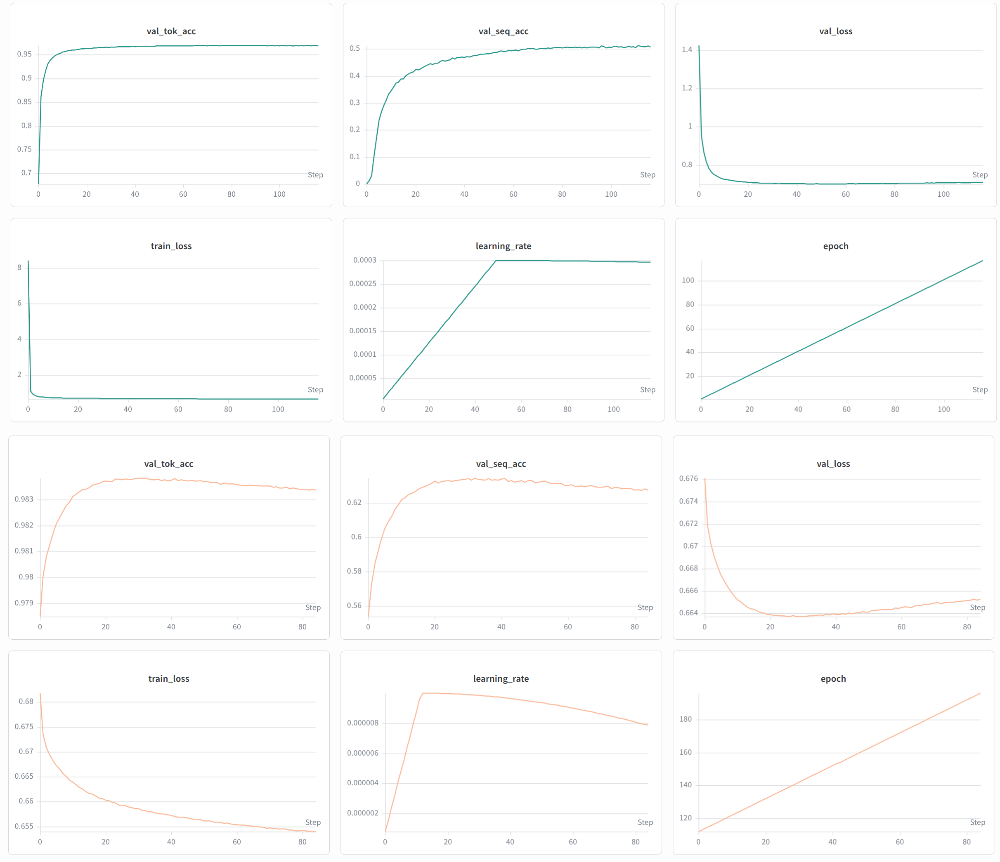

<div align="center">
  <h1>Plot2Eq 📈</h1>
  <p><b>Reverse-Engineering Math Formulas from Hand-Drawn Graphs</b></p>

  <a href="https://huggingface.co/spaces/YauheniShe/Plot2Eq">
    
  </a>
  <a href="https://www.kaggle.com/datasets/yauhenisheshukou/plot2eq-dataset">
    
  </a>
  
  
  
</div>

<br>

**Plot2Eq** is a Machine Learning web application that predicts the exact mathematical formula of a function $y = f(x)$ simply by looking at its plotted curve. Draw a graph on the canvas, and the model will reverse-engineer the underlying mathematical expression.

## 🌟 Live Demo

Try the application directly in your browser:
**[Launch Plot2Eq on Hugging Face Spaces](https://huggingface.co/spaces/YauheniShe/Plot2Eq)**


<p align="center">
  
</p>


## 💡 How It Works (The Architecture)

Predicting an exact mathematical formula with specific constants (e.g., $y = 2.87 \log(0.5x + 4.75) + 0.24$) directly from an image is highly unstable for deep learning models. 

To solve this, the project uses a highly effective **Two-Stage Pipeline**:

1. **🧠 Deep Learning (Skeleton Prediction):**
   A Point-to-Sequence neural network analyzes the shape of the curve (represented as a normalized 256-point sequence with masks for asymptotes) and predicts the general mathematical "skeleton" with `C` placeholders.
   * **Encoder:** `ConvNeXt1D` architecture for robust local feature extraction.
   * **Decoder:** A modern Transformer Decoder featuring `RMSNorm`, `SwiGLU` activations, and Rotary Positional Embeddings (`RoPE`).
   * *Example Output:* `C * log(C * x + C) + C`

2. **⚙️ Mathematical Optimization & Candidate Ranking:**
   A global optimization algorithm (`scipy.optimize.differential_evolution`) fits the constants to the user's drawn points. To handle asymptotes robustly and penalize overly complex expressions (Occam's razor), the candidates from Beam Search are ranked using a custom scoring function:

   $$ \text{Robust MSE} = \frac{1}{N_{valid}} \sum (\hat{y}_i - y_i)^2 + \lambda \left( \frac{N_{total} - N_{valid}}{N_{total}} \right) $$
   
   $$ \text{Final Score} =  \frac{100}{\text{Robust MSE} + \alpha \cdot L_{seq} + 1} $$

   *(where $\lambda$ is a penalty for undefined regions/NaNs, and $\alpha$ is a length penalty for the sequence of tokens).*


## 📊 Dataset & Generation Pipeline

To train the model, a massive synthetic dataset was generated and rigorously cleaned. 

* **Total Samples:** ~1.47 Million unique graphs.
* **Pipeline:** 
  1. AST-based random equation generation (`sympy`).
  2. Canonicalization (e.g., replacing `cos` with `sin` with phase shifts).
  3. Bounding box normalization and mask generation for discontinuities.
  4. **GPU-Accelerated Collision Removal:** A custom PyTorch script that removes visually identical functions under Occam's razor (keeping the shortest formula).
* **Format:** Pre-compiled PyTorch Tensors (`.pt`).

**[>> Download the Plot2Eq Dataset on Kaggle <<](https://www.kaggle.com/datasets/yauhenisheshukou/plot2eq-dataset)**

## 🚀 Quick Start

### Option 1: Local Setup (Python)

1. **Clone the repository:**
   ```bash
   git clone https://github.com/YauheniShe/Plot2Eq.git
   cd Plot2Eq
   ```

2. **Install dependencies:**
   The project is packaged with a `pyproject.toml` file.
   ```bash
   pip install -e .
   ```

3. **Run the FastAPI Web App:**
   ```bash
   cd app
   uvicorn main:app --reload --host 0.0.0.0 --port 8000
   ```
   Open `http://localhost:8000` in your browser.

### Option 2: Docker 🐳

The project is fully containerized for easy deployment (used for the HuggingFace Spaces instance).

```bash
# Build the image
docker build -t plot2eq-app .

# Run the container
docker run -d -p 7860:7860 --name plot2eq plot2eq-app
```
Access the app at `http://localhost:7860`.

## 📈 Model Performance & Training

The model was trained using `PyTorch 2.x` (`torch.compile`, `bfloat16` autocast) and tracked via **Weights & Biases (W&B)**.
* **Token Accuracy:** **> 95%**
* **Sequence Accuracy:** **~ 50-60%** *(This is an exact, full-string match of the mathematical skeleton!)*
* **Loss:** CrossEntropy with label smoothing and Cosine Annealing learning rate schedule.

<p align="center">
  
</p>

## 📂 Project Structure

```text
.
├── app/                  # FastAPI backend and Jinja2 UI templates
├── checkpoints/          # Saved model weights (.pth)
├── data/                 # Raw and compiled dataset chunks
├── src/plot2eq/          # Core ML package
│   ├── core/             # Tokenizer, AST Generation, SymPy logic
│   ├── data_prep/        # Data Generation, Normalization, GPU Collisions removal
│   ├── data_utils/       # PyTorch Datasets, Dataloaders, Hand-drawn Augmentations
│   ├── inference/        # Beam Search, SciPy Differential Evolution logic
│   ├── models/           # Point-to-Sequence (ConvNeXt1D + Transformer + RoPE)
│   └── training/         # PyTorch training loop and W&B loggers
├── scripts/              # Build & Filter dataset scripts
├── pyproject.toml        # Project dependencies
└── Dockerfile            # Container configuration
```

## 🛠 Inference API Usage

You can use the pipeline directly in your Python code:

```python
import torch
from PIL import Image
from plot2eq.core.tokenizer import Tokenizer
from plot2eq.models.core_model import Plot2EqModel
from plot2eq.inference.pipeline import predict_top_k_equations
from app.main import process_image_to_math, create_model_tensor

# 1. Initialize tokenizer & model
tokenizer = Tokenizer()
model = Plot2EqModel(
    vocab_size=len(tokenizer.tokens),
    pad_idx=tokenizer.token_map["<pad>"],
    # ... match with your TrainConfig parameters
)
model.load_state_dict(torch.load("checkpoints/v2/best_model.pth")["model_state_dict"])
model.eval()

# 2. Extract points & mask from an image
image = Image.open("your_drawn_graph.png").convert("RGBA")
x_math, y_math, mask = process_image_to_math(image)
pts_tensor = create_model_tensor(x_math, y_math, mask)

# 3. Predict equations via Beam Search & Constant Fitting
results = predict_top_k_equations(
    model=model,
    points_tensor=pts_tensor,
    tokenizer=tokenizer,
    x_data=x_math[mask],
    y_data=y_math[mask],
    beam_size=5,
    top_k=3
)

print(f"Top Skeleton: {results[0]['skeleton']}")
print(f"Fitted Equation: {results[0]['best_expr']}")
print(f"MSE: {results[0]['mse']}")